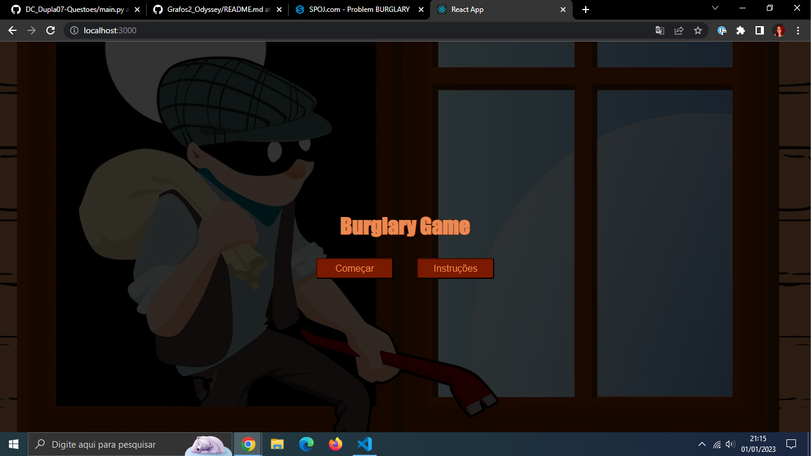
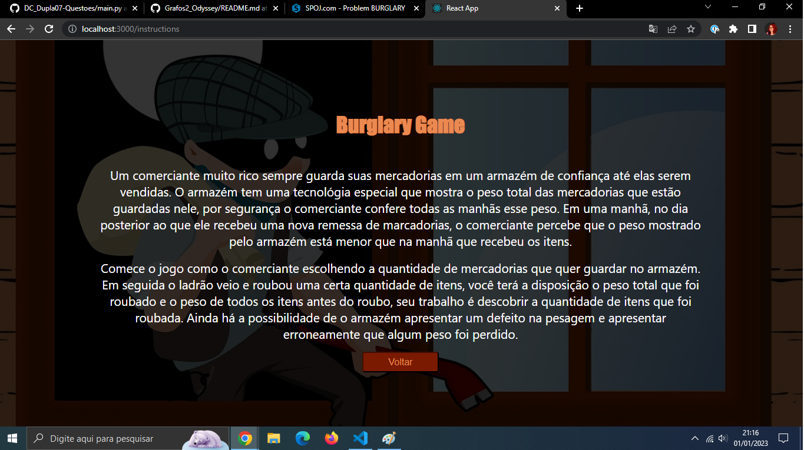
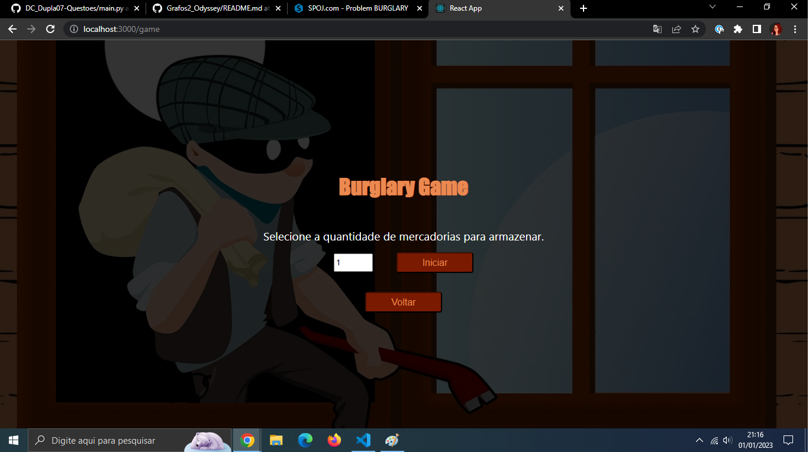
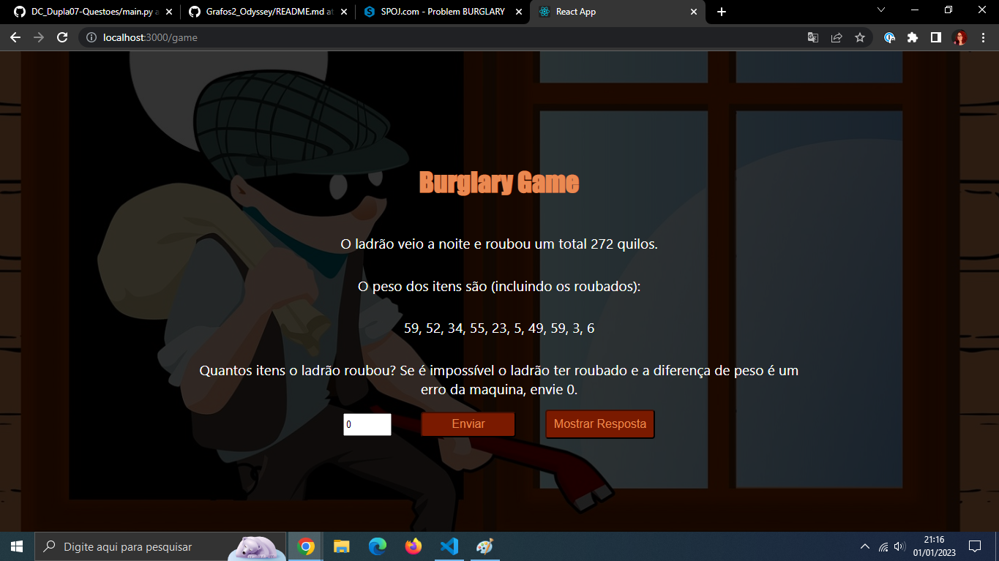
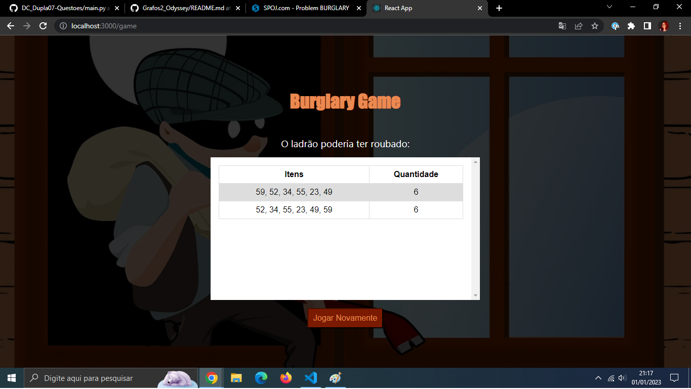

# Burglary

**Número da Lista**: 07<br>
**Conteúdo da Disciplina**: Divide and conquer<br>

## Alunos
|Matrícula | Aluno |
| -- | -- |
| 18/0099353 |  Cibele Freitas Goudinho |
| 16/0127327 |  João Paulo Coelho de Souza |

## Sobre 
Com base em um exercício de juiz online sobre dividir e conquistar, criamos um jogo no qual você tem um armazém com uma certa quantidades de itens dentro, essa quantidade é de sua escolha (entre 1 e 50). Você tem o peso de cada objeto e o peso total no armazém. 

Um ladrão veio e roubou uma quantidade x de itens, como o armazém lhe mostra o peso total dentro dele, temos o peso total dos objetos roubados. Sabendo disso, o objetivo é descobrir quantos objetos o ladrão roubou.

## Screenshots
### Página Incial


### Instruções


### Início do jogo


### Jogo


### Resposta de Falha


### Resposta de Sucesso


### Resposta de Desistência



## Instalação 
**Linguagem**: Python e ReactJS<br>
**Framework**: FastAPI<br>
Precisa rodar o front e o back ao mesmo tempo, recomenda-se utilizar dois terminais para tal, um na pasta back e outra na pasta front.
### Primeiro entre na pasta Burglary:
```
cd Burglary
```
### Dentro da pasta back: 
Pode ser que utilize python ao invés de python3 (válido para todos os comandos)
Entrar no back:
```
cd back
```
Criar env:
```
python3 -m venv .venv
```
Ativar env:
```
source .venv/bin/activate
```
Instalar requirements:
```
pip install -r requirements.txt
```
Rodar o projeto:
```
uvicorn main:app --reload --host 0.0.0.0 --port 8004
```
### Dentro da pasta front:
Entrar no front:
```
cd front
```
```
npm install
```
```
npm start
```

## Uso 
1. Escolha se quer ver as instruções ou começar o jogo 
2. Se escolher começar o jogo, selecione um número de 0 a 50 correspondentes a quantidade de itens iniciais
3. Clique em iniciar
4. Vendo o peso de todos dos itens antes do roubo e o peso total que sumiu do armazém, tente encontrar quantos itens o ladrão pode ter roubado
5. Clicar em enviar

## Apresentação
https://user-images.githubusercontent.com/40813329/210288852-3608daad-4718-4337-8d5b-c02af1030e60.mp4

## Outros 
O jogo foi baseado no exercício [Burglary Boat](https://www.spoj.com/problems/BURGLARY/).


